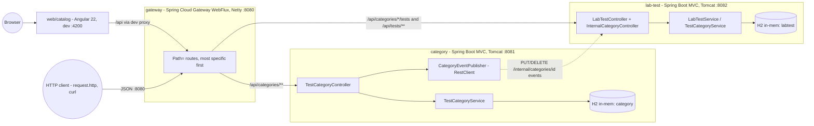
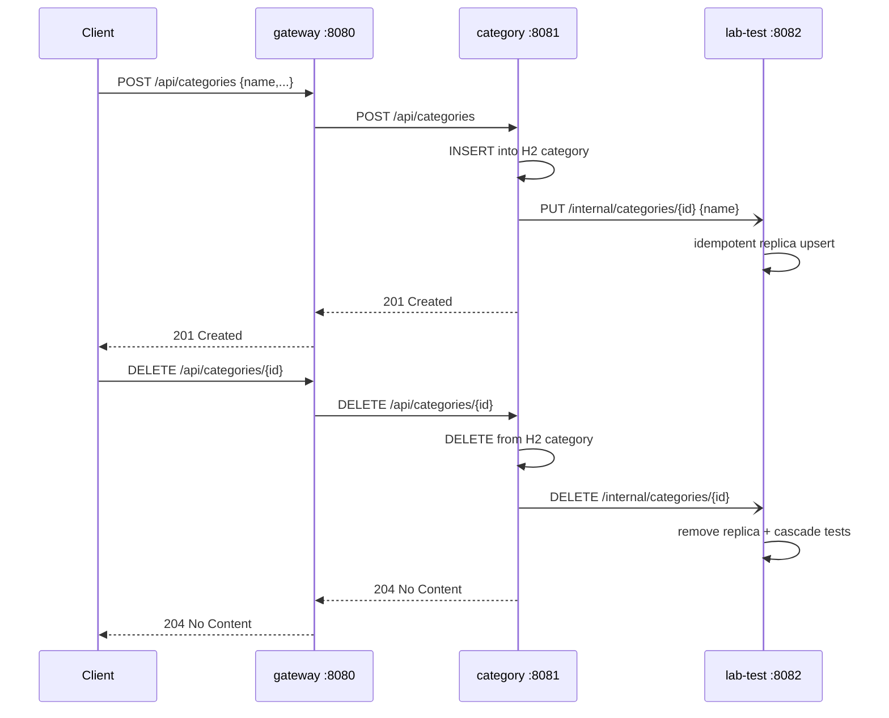
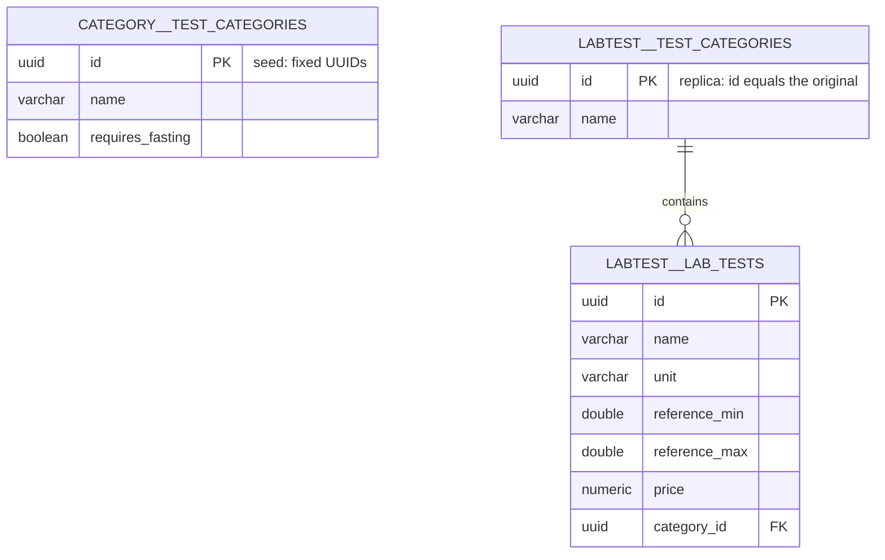

# Medata — architecture

> English version. Polish 1:1 counterpart: [../pl/ARCHITECTURE.md](../pl/ARCHITECTURE.md)
> As of: lab 4 (microservices + gateway). Convention §6: an architecture change without a diagram update = an unfinished change.

## Container view

Each service owns a **private** H2 database — there is no shared schema and no foreign key across services. Consistency is kept by REST events and the fixed seed UUIDs.

## Event flow (replica sync)

Publishing is **best-effort**: a network failure does not break the category operation (`try/catch` → WARN in the log). The `lab-test` handlers are **idempotent** (PUT = upsert, DELETE of a missing replica → 204), so a repeated event does no harm. A category rename is NOT propagated (a deliberate gap — the instruction requires events only on add/remove).

## Routing (gateway)

| Order | `Path=` predicate | Target |
|---|---|---|
| 0 | `/api/categories/*/tests` | lab-test :8082 |
| 1 | `/api/categories/**` | category :8081 |
| 2 | `/api/tests/**` | lab-test :8082 |

Most specific first — the category catch-all would otherwise steal test requests. `/internal/**` deliberately has **no route**: the event API is unreachable from outside. Executable examples: `services/gateway/request.http` (everything via :8080).

## API per service

- **category (:8081):** `GET/POST /api/categories`, `GET/PUT/DELETE /api/categories/{id}` — semantics and codes as in lab 3; POST and DELETE additionally publish an event to lab-test.
- **lab-test (:8082):** `GET /api/tests`, `GET/PUT/DELETE /api/tests/{id}`, `GET/POST /api/categories/{categoryId}/tests` plus the internal `PUT/DELETE /internal/categories/{id}`. Detailed tables: `services/<name>/docs/en/README.md`.

## Data model (ERD) — two private databases

The prefix names the database (`category` / `labtest`). The replica holds the minimum needed for the relation and DTOs; the `REMOVE` + `orphanRemoval` cascade works locally inside the labtest database.

## Plans

Lab 6: a Dockerfile per service + an NGINX image for the frontend (taking over the dev-proxy role) + `docker compose up`. Lab 7: discovery, 2 lab-test instances, load balancing at the gateway, external databases, a config service.
