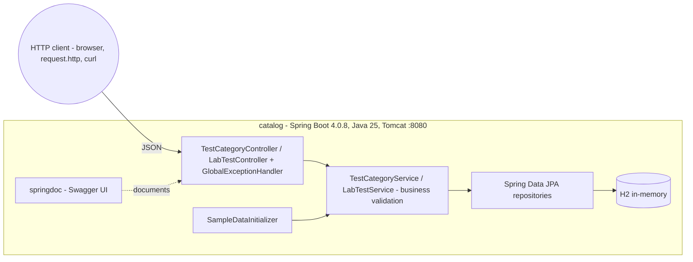
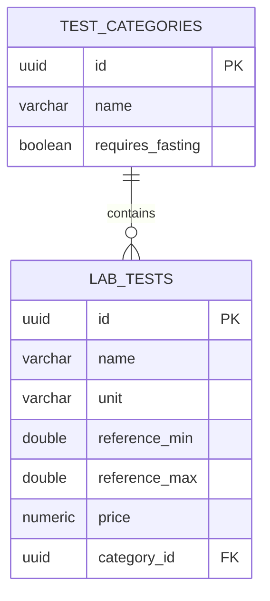

# Medata — architecture

> English version. Polish 1:1 counterpart: [../pl/ARCHITECTURE.md](../pl/ARCHITECTURE.md)
> As of: lab 3 (REST web application). Convention §6: an architecture change without a diagram update = an unfinished change.

## Container view

## Layers

REST controllers (entity↔DTO mapping, HTTP codes) → services (delegation + validation) → repositories → H2. Validation exceptions (`IllegalArgumentException`) are turned into `400` by the global `GlobalExceptionHandler`. The JPA session lives for the whole request (Open Session In View — Spring Boot default), so mapping lazy relations in controllers works.

## API (REST, JSON)

| Endpoint | Description | Codes |
|---|---|---|
| `GET /api/categories` | Category list (id + name) | 200 |
| `POST /api/categories` | Creates a category | 201 |
| `GET /api/categories/{id}` | Full category data | 200, 404 |
| `PUT /api/categories/{id}` | Updates a category | 204, 404 |
| `DELETE /api/categories/{id}` | Deletes a category **with its tests** (cascade) | 204, 404 |
| `GET /api/categories/{categoryId}/tests` | Tests of a category (empty → 200 and `[]`; missing → 404) | 200, 404 |
| `POST /api/categories/{categoryId}/tests` | Adds a test to a category (the only way to create tests) | 201, 400, 404 |
| `GET /api/tests` | List of all tests (id + name) | 200 |
| `GET /api/tests/{id}` | Full test data (category flattened to its name) | 200, 404 |
| `PUT /api/tests/{id}` | Updates a test | 204, 400, 404 |
| `DELETE /api/tests/{id}` | Deletes a test | 204, 404 |

Live docs: Swagger UI at `http://localhost:8080/swagger-ui.html`; executable examples: `catalog/request.http`.

## Data model (ERD)

The 1:N relation is bidirectional in code; the database holds the `category_id` foreign key; both directions lazy; deleting a category cascades to its tests (`CascadeType.REMOVE` + `orphanRemoval`).

## Plans

Lab 4 will split the application into two microservices (categories, tests) + a gateway — diagrams will be updated then.
