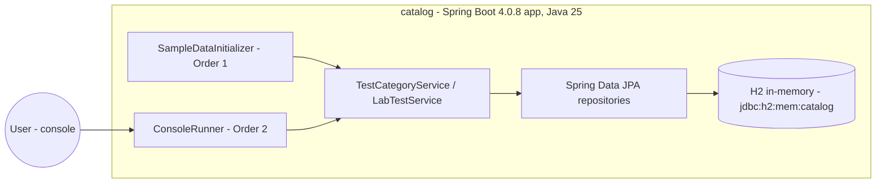
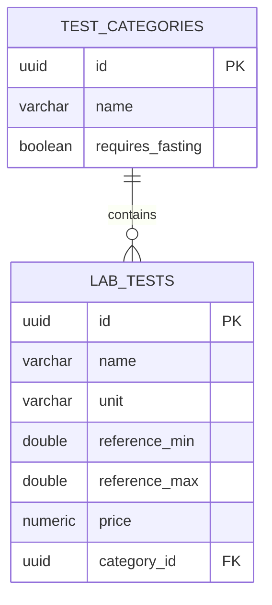

# Medata — architecture

> English version. Polish 1:1 counterpart: [../pl/ARCHITECTURE.md](../pl/ARCHITECTURE.md)
> As of: lab 2 (single application). Convention §6: an architecture change without a diagram update = an unfinished change.

## Container view

## Layers

Runner (console UI) → services (delegation + business validation) → repositories (data access) → H2. Each layer knows only its lower neighbour; dependencies are injected by Spring's DI container.

## Data model (ERD)

The 1:N relation is bidirectional in code (`TestCategory.labTests` ↔ `LabTest.category`); the database holds only the `category_id` foreign key (owning side). Both directions are lazy.

## Plans

Lab 4 will split the application into two microservices (categories, tests) + a gateway — diagrams will be updated then.
