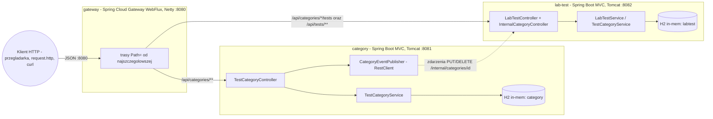
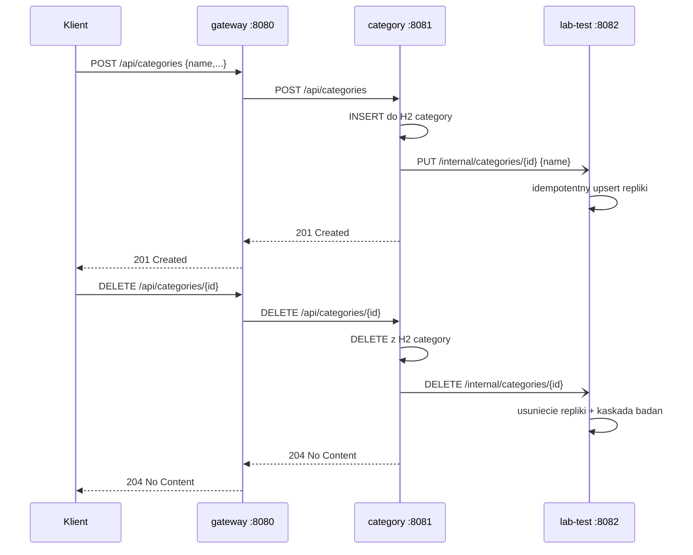
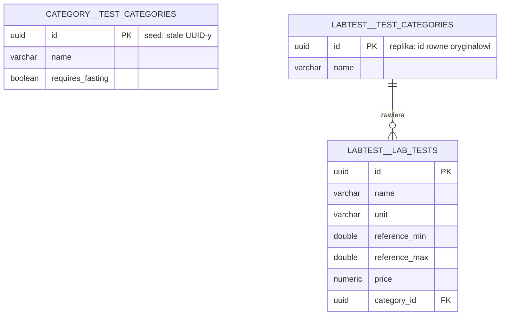

# Medata — architektura

> Wersja polska. Angielski odpowiednik 1:1: [../en/ARCHITECTURE.md](../en/ARCHITECTURE.md)
> Stan na: lab 4 (mikroserwisy + gateway). Konwencja §6: zmiana architektury bez aktualizacji diagramu = zmiana nieukończona.

## Widok kontenerów

Każdy serwis ma **prywatną** bazę H2 — nie istnieje wspólny schemat ani klucz obcy między serwisami. Spójność utrzymują zdarzenia REST i stałe UUID-y seedu.

## Przepływ zdarzeń (synchronizacja repliki)

Wysyłka jest **best-effort**: błąd sieci nie psuje operacji na kategorii (`try/catch` → WARN w logu). Handlery w `lab-test` są **idempotentne** (PUT = upsert, DELETE nieistniejącej → 204), więc powtórzone zdarzenie nie szkodzi. Zmiana nazwy kategorii NIE jest propagowana (świadoma luka — instrukcja wymaga zdarzeń tylko przy dodaniu/usunięciu).

## Routing (gateway)

| Kolejność | Predykat `Path=` | Cel |
|---|---|---|
| 0 | `/api/categories/*/tests` | lab-test :8082 |
| 1 | `/api/categories/**` | category :8081 |
| 2 | `/api/tests/**` | lab-test :8082 |

Kolejność od najszczegółowszej — catch-all kategorii przechwyciłby żądania o badania. `/internal/**` celowo **bez trasy**: API zdarzeń jest nieosiągalne z zewnątrz. Wykonywalne przykłady: `services/gateway/request.http` (wszystko przez :8080).

## API per serwis

- **category (:8081):** `GET/POST /api/categories`, `GET/PUT/DELETE /api/categories/{id}` — semantyka i kody jak w labie 3; POST i DELETE dodatkowo publikują zdarzenie do lab-test.
- **lab-test (:8082):** `GET /api/tests`, `GET/PUT/DELETE /api/tests/{id}`, `GET/POST /api/categories/{categoryId}/tests` oraz wewnętrzne `PUT/DELETE /internal/categories/{id}`. Szczegółowe tabele: `services/<nazwa>/docs/pl/README.md`.

## Model danych (ERD) — dwie prywatne bazy

Prefiks oznacza bazę (`category` / `labtest`). Replika trzyma minimum potrzebne do relacji i DTO; kaskada `REMOVE` + `orphanRemoval` działa lokalnie w bazie labtest.

## Plany

Lab 5: frontend Angular (przez gateway). Lab 6: Dockerfile per serwis + `docker compose up`. Lab 7: discovery, 2 instancje lab-test, load balancing na gatewayu, zewnętrzne bazy, config service.
