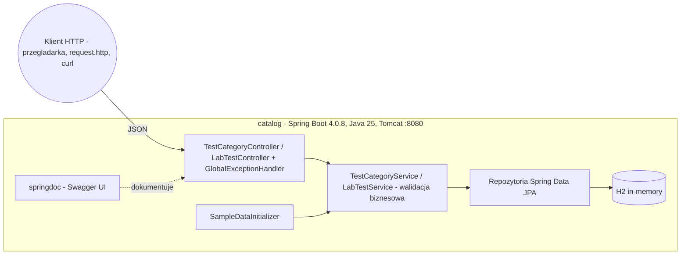
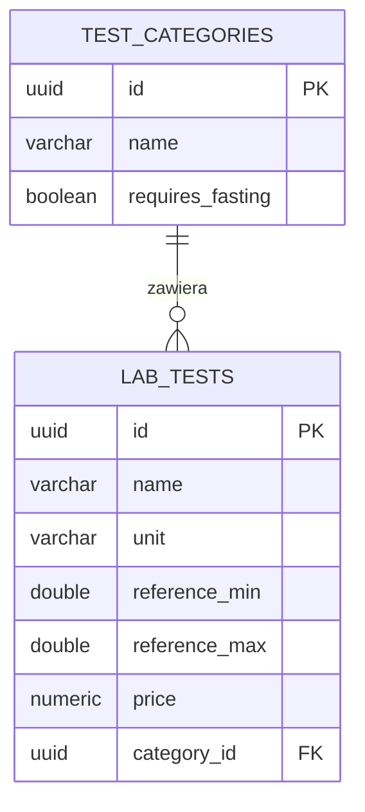

# Medata — architektura

> Wersja polska. Angielski odpowiednik 1:1: [../en/ARCHITECTURE.md](../en/ARCHITECTURE.md)
> Stan na: lab 3 (aplikacja webowa REST). Konwencja §6: zmiana architektury bez aktualizacji diagramu = zmiana nieukończona.

## Widok kontenerów

## Warstwy

Kontrolery REST (mapowanie encja↔DTO, kody HTTP) → serwisy (delegacja + walidacja) → repozytoria → H2. Wyjątki walidacji (`IllegalArgumentException`) zamienia na `400` globalny `GlobalExceptionHandler`. Sesja JPA żyje przez całe żądanie (Open Session In View — domyślne w Spring Boot), dzięki czemu mapowanie leniwych relacji w kontrolerze działa.

## API (REST, JSON)

| Endpoint | Opis | Kody |
|---|---|---|
| `GET /api/categories` | Lista kategorii (id + nazwa) | 200 |
| `POST /api/categories` | Tworzy kategorię | 201 |
| `GET /api/categories/{id}` | Pełne dane kategorii | 200, 404 |
| `PUT /api/categories/{id}` | Aktualizuje kategorię | 204, 404 |
| `DELETE /api/categories/{id}` | Usuwa kategorię **wraz z badaniami** (kaskada) | 204, 404 |
| `GET /api/categories/{categoryId}/tests` | Badania kategorii (pusta → 200 i `[]`; nieistniejąca → 404) | 200, 404 |
| `POST /api/categories/{categoryId}/tests` | Dodaje badanie do kategorii (jedyna droga tworzenia badań) | 201, 400, 404 |
| `GET /api/tests` | Lista wszystkich badań (id + nazwa) | 200 |
| `GET /api/tests/{id}` | Pełne dane badania (kategoria spłaszczona do nazwy) | 200, 404 |
| `PUT /api/tests/{id}` | Aktualizuje badanie | 204, 400, 404 |
| `DELETE /api/tests/{id}` | Usuwa badanie | 204, 404 |

Dokumentacja żywa: Swagger UI `http://localhost:8080/swagger-ui.html`; wykonywalne przykłady: `catalog/request.http`.

## Model danych (ERD)

Relacja 1:N dwustronna w kodzie, w bazie klucz obcy `category_id`; obie strony leniwe; usunięcie kategorii kaskaduje na badania (`CascadeType.REMOVE` + `orphanRemoval`).

## Plany

Lab 4 rozetnie aplikację na dwa mikroserwisy (kategorie, badania) + gateway — diagramy zostaną wtedy zaktualizowane.
