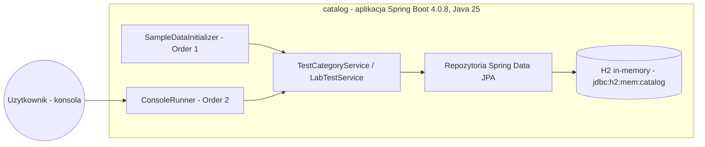
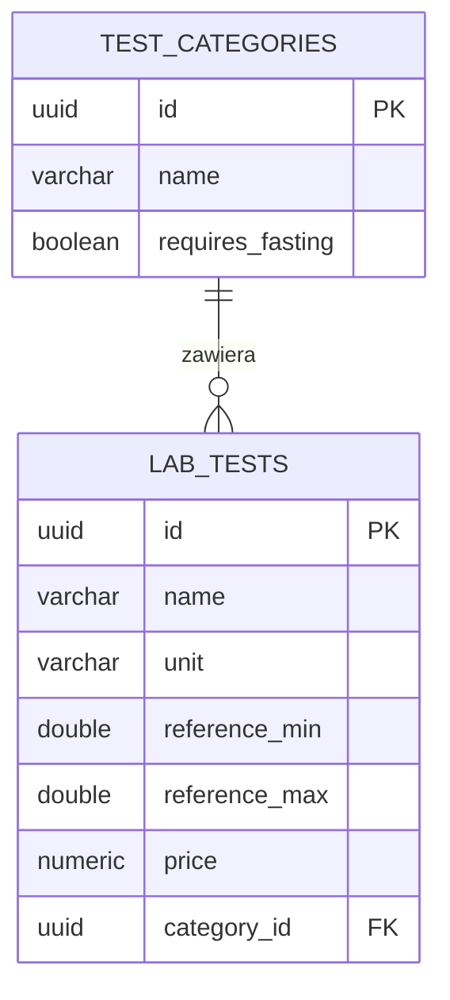

# Medata — architektura

> Wersja polska. Angielski odpowiednik 1:1: [../en/ARCHITECTURE.md](../en/ARCHITECTURE.md)
> Stan na: lab 2 (pojedyncza aplikacja). Konwencja §6: zmiana architektury bez aktualizacji diagramu = zmiana nieukończona.

## Widok kontenerów

## Warstwy

Runner (UI konsolowe) → serwisy (delegacja + walidacja biznesowa) → repozytoria (dostęp do danych) → H2. Każda warstwa zna tylko sąsiada niżej; zależności wstrzykuje kontener DI Springa.

## Model danych (ERD)

Relacja 1:N dwustronna w kodzie (`TestCategory.labTests` ↔ `LabTest.category`), w bazie tylko klucz obcy `category_id` (strona właściciela). Obie kolekcje leniwe.

## Plany

Lab 4 rozetnie aplikację na dwa mikroserwisy (kategorie, badania) + gateway — diagramy zostaną wtedy zaktualizowane.
